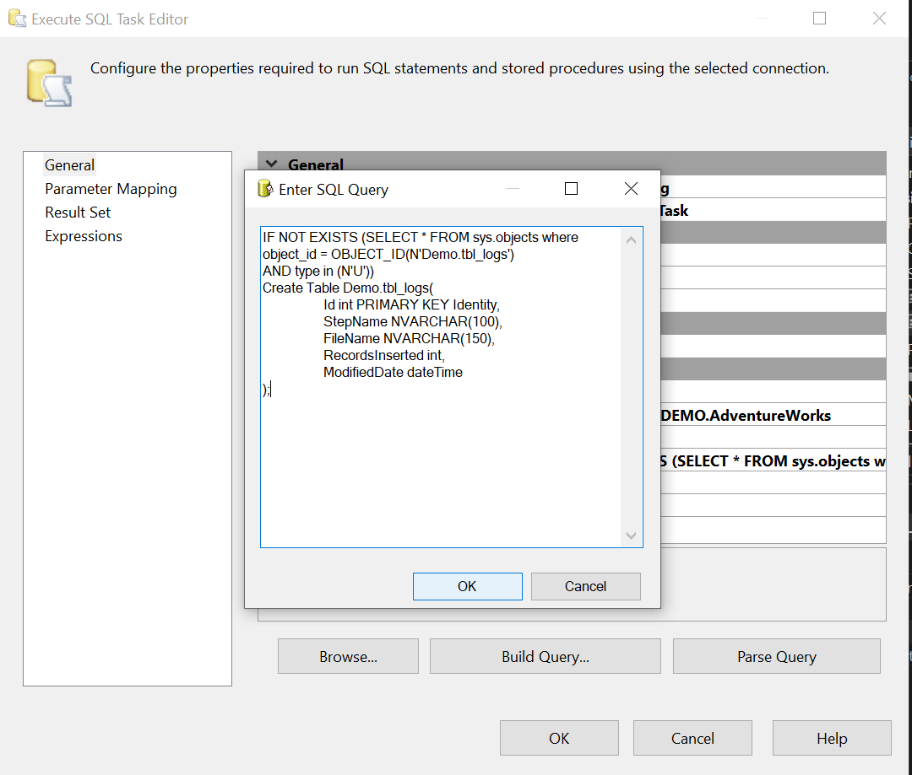

Basic file load Multiple files (ETL)

configure Foreach Loop Container

Configure FileManager

Precedence constrainst config

Derive Column config

Destination OLE DB config

Load new files and archive files after load (ETL)

Log table query

RecordsInsert Epression

Script Task config

