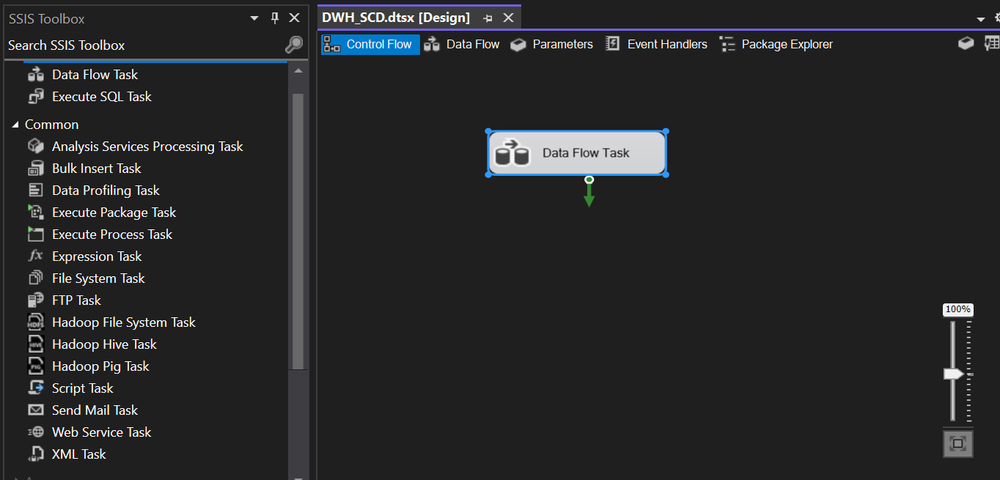
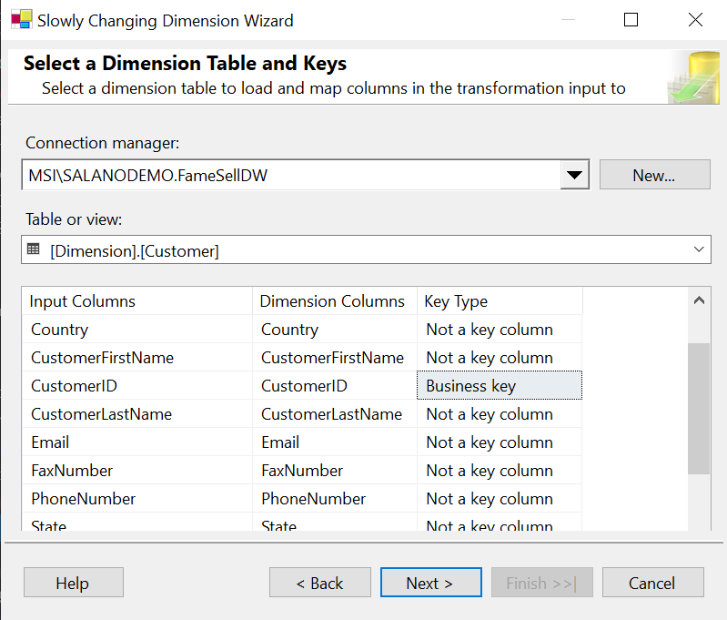
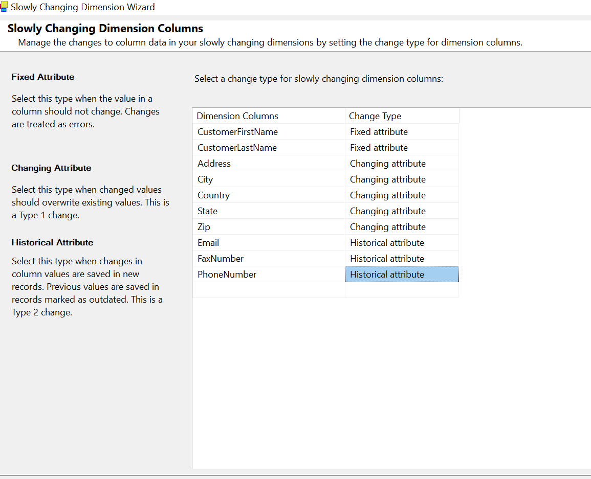
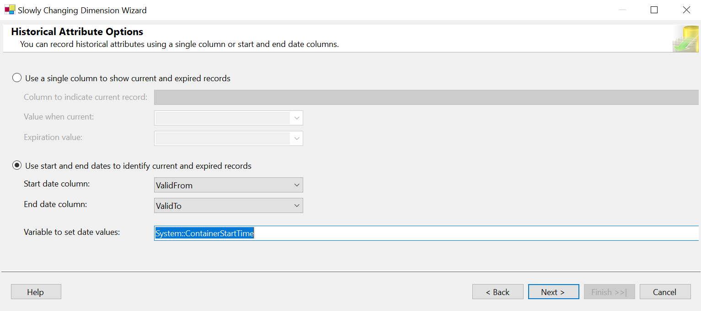
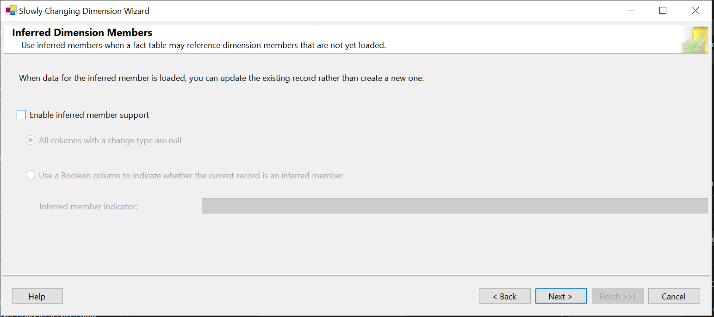
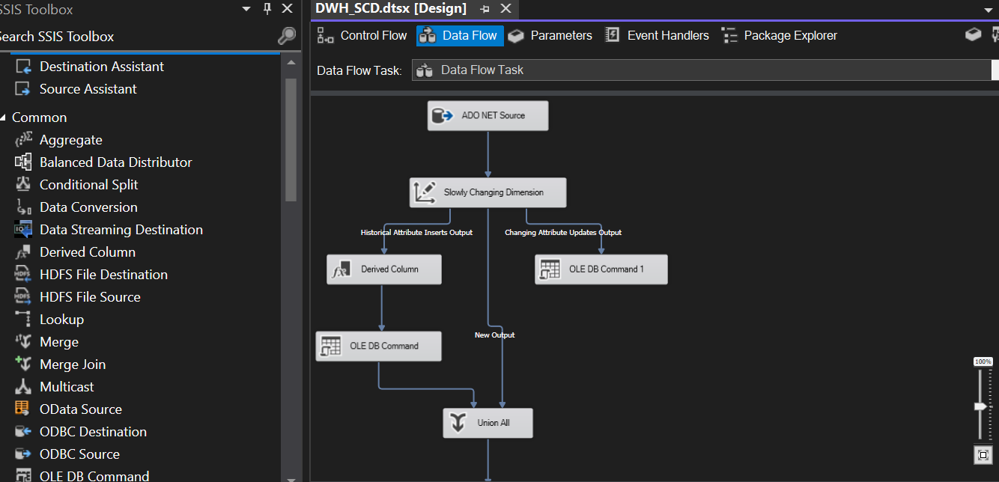
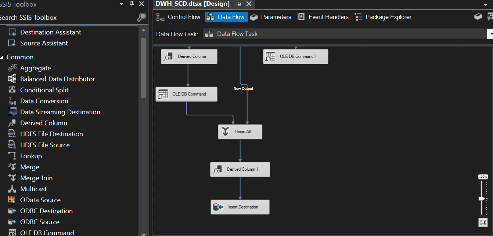

This sections creates a SSIS Slowly Changing Dimension between a source database and a simulated data warehouse.

The table used by the job.

Source table:

```


CREATE TABLE [dbo].[Customers](
	[CustomerID] [int] NOT NULL,
	[CustomerFirstName] [nvarchar](100) NULL,
	[CustomerLastName] [nvarchar](100) NULL,
	[PhoneNumber] [nvarchar](20) NULL,
	[FaxNumber] [nvarchar](20) NULL,
	[Email] [nvarchar](100) NULL,
	[Address] [nvarchar](60) NULL,
	[City] [nvarchar](100) NULL,
	[State] [nvarchar](100) NULL,
	[Zip] [nvarchar](60) NOT NULL,
	[Country] [nvarchar](60) NULL,
	[ValidFrom] [datetime2](7) NULL,
	[ValidTo] [datetime2](7) NULL,
 CONSTRAINT [PK_Customers] PRIMARY KEY CLUSTERED
(
	[CustomerID] ASC
)WITH (PAD_INDEX = OFF, STATISTICS_NORECOMPUTE = OFF, IGNORE_DUP_KEY = OFF, ALLOW_ROW_LOCKS = ON, ALLOW_PAGE_LOCKS = ON, OPTIMIZE_FOR_SEQUENTIAL_KEY = OFF) ON [PRIMARY]
) ON [PRIMARY]

```

Destination Table (data Warehouse table)

```
CREATE TABLE [Dimension].[Customer](
	[CustomerSK] [int] IDENTITY(1,1) NOT NULL,
	[CustomerID] [int] NOT NULL,
	[CustomerFirstName] [nvarchar](100) NULL,
	[CustomerLastName] [nvarchar](100) NULL,
	[PhoneNumber] [nvarchar](20) NULL,
	[FaxNumber] [nvarchar](20) NULL,
	[Email] [nvarchar](100) NULL,
	[Address] [nvarchar](60) NULL,
	[City] [nvarchar](100) NULL,
	[State] [nvarchar](100) NULL,
	[Zip] [nvarchar](60) NOT NULL,
	[Country] [nvarchar](60) NULL,
	[ValidFrom] [datetime2](7) NULL,
	[ValidTo] [datetime2](7) NULL,
 CONSTRAINT [PK_Dimension_Customer] PRIMARY KEY CLUSTERED
(
	[CustomerSK] ASC
)WITH (PAD_INDEX = OFF, STATISTICS_NORECOMPUTE = OFF, IGNORE_DUP_KEY = OFF, ALLOW_ROW_LOCKS = ON, ALLOW_PAGE_LOCKS = ON, OPTIMIZE_FOR_SEQUENTIAL_KEY = OFF) ON [PRIMARY]
) ON [PRIMARY]
`

```

Add a 'Data Flow Task' to the control flow

Add 'OLE DB source' to the dataflow and configure the source connection and table

Add a 'Slowly Changing Dimension' task to the control flow and configure as illustrated below




Upon completion of the 'Slowly Changing Dimension' task, the remaining steps in the dataflow task will be auto generated as follow:


