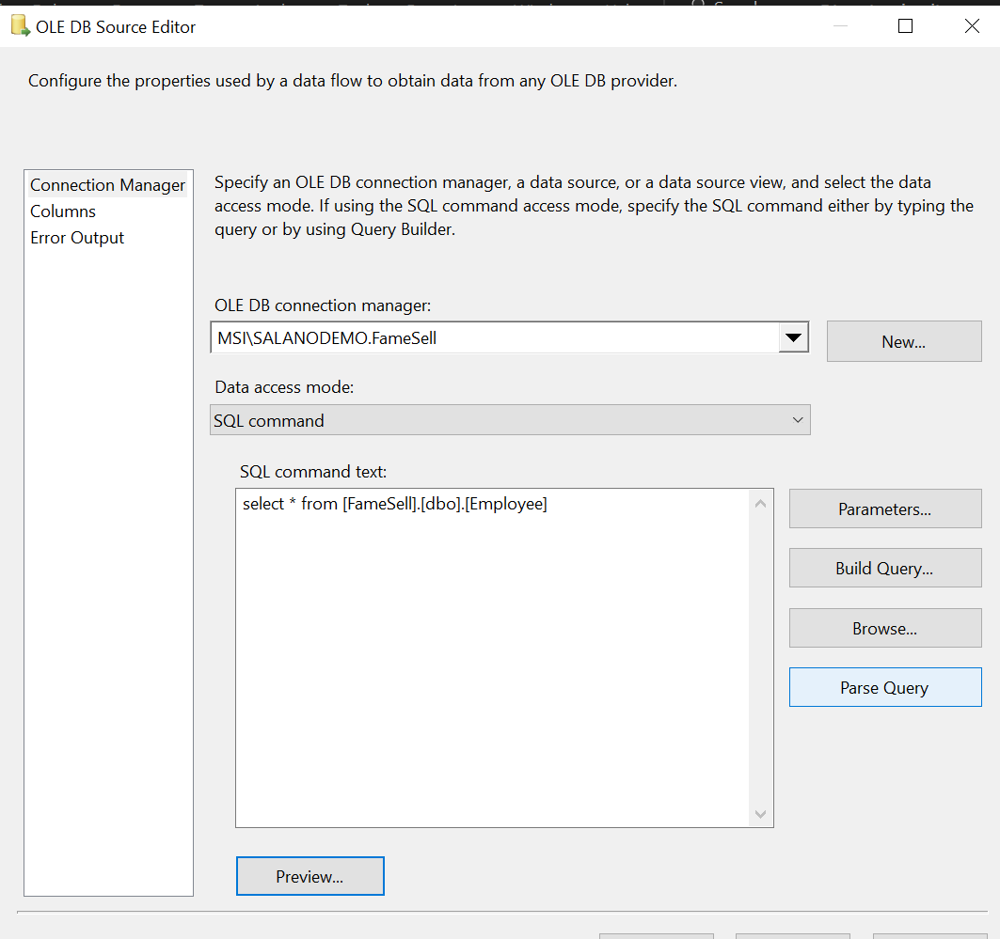

In this section I will go over the steps to do dimension table loading witout using the SLOW Changing Dimension transformation in SSIS.

Create Source table

```
CREATE TABLE [dbo].[Employee](
	[EmployeeID] [int] NOT NULL,
	[FirstName] [nvarchar](50) NOT NULL,
	[LastName] [nvarchar](50) NOT NULL,
	[IsPermittedToLogon] [bit] NOT NULL,
	[LogonName] [nvarchar](50) NULL,
	[IsSalesperson] [bit] NOT NULL,
	[PhoneNumber] [nvarchar](20) NULL,
	[FaxNumber] [nvarchar](20) NULL,
	[Email] [nvarchar](256) NULL,
	[ValidFrom] [datetime2](7) NOT NULL,
	[ValidTo] [datetime2](7) NULL,
 CONSTRAINT [PK_Employee] PRIMARY KEY CLUSTERED
(
	[EmployeeID] ASC
)WITH (PAD_INDEX = OFF, STATISTICS_NORECOMPUTE = OFF, IGNORE_DUP_KEY = OFF, ALLOW_ROW_LOCKS = ON, ALLOW_PAGE_LOCKS = ON, OPTIMIZE_FOR_SEQUENTIAL_KEY = OFF) ON [PRIMARY]
) ON [PRIMARY]
GO

```

Create data warehouse table

```
CREATE TABLE [Dimension].[Employee](
	[EmployeeSK] [int] IDENTITY(1,1) NOT NULL,
	[EmployeeID] [int] NOT NULL,
	[FirstName] [nvarchar](50) NOT NULL,
	[LastName] [nvarchar](50) NOT NULL,
	[IsPermittedToLogon] [bit] NOT NULL,
	[LogonName] [nvarchar](50) NULL,
	[IsSalesperson] [bit] NOT NULL,
	[PhoneNumber] [nvarchar](20) NULL,
	[FaxNumber] [nvarchar](20) NULL,
	[Email] [nvarchar](256) NULL,
	[ValidFrom] [datetime2](7) NOT NULL,
	[ValidTo] [datetime2](7) NULL,
 CONSTRAINT [PK_EmpolyeeSK] PRIMARY KEY CLUSTERED
(
	[EmployeeSK] ASC
)WITH (PAD_INDEX = OFF, STATISTICS_NORECOMPUTE = OFF, IGNORE_DUP_KEY = OFF, ALLOW_ROW_LOCKS = ON, ALLOW_PAGE_LOCKS = ON, OPTIMIZE_FOR_SEQUENTIAL_KEY = OFF) ON [PRIMARY]
) ON [PRIMARY]
GO
```

Create Staging Tables

```
IF EXISTS (SELECT \* FROM sys.objects WHERE object_id = OBJECT_ID(N'[dbo].[Employee_Insert]') AND type in (N'U'))
DROP TABLE [dbo].[Employee_Insert]
GO

SET ANSI_NULLS ON
GO

SET QUOTED_IDENTIFIER ON
GO

CREATE TABLE [dbo].[Employee_Insert](
[EmployeeID] [int] NOT NULL,
[FirstName] [nvarchar](50) NOT NULL,
[LastName] [nvarchar](50) NOT NULL,
[IsPermittedToLogon] [bit] NOT NULL,
[LogonName] [nvarchar](50) NULL,
[IsSalesperson] [bit] NOT NULL,
[PhoneNumber] [nvarchar](20) NULL,
[FaxNumber] [nvarchar](20) NULL,
[Email] [nvarchar](256) NULL,
[ValidFrom] [datetime2](7) NOT NULL,
CONSTRAINT [PK_Empolyee_Insert] PRIMARY KEY CLUSTERED
(
[EmployeeID] ASC
)WITH (PAD_INDEX = OFF, STATISTICS_NORECOMPUTE = OFF, IGNORE_DUP_KEY = OFF, ALLOW_ROW_LOCKS = ON, ALLOW_PAGE_LOCKS = ON, OPTIMIZE_FOR_SEQUENTIAL_KEY = OFF) ON [PRIMARY]
) ON [PRIMARY]
GO

IF EXISTS (SELECT \* FROM sys.objects WHERE object_id = OBJECT_ID(N'[dbo].[Employee_Update]') AND type in (N'U'))
DROP TABLE [dbo].[Employee_Update]
GO

SET ANSI_NULLS ON
GO

SET QUOTED_IDENTIFIER ON
GO

CREATE TABLE [dbo].[Employee_Update](
[EmployeeID] [int] NOT NULL,
[FirstName] [nvarchar](50) NOT NULL,
[LastName] [nvarchar](50) NOT NULL,
[IsPermittedToLogon] [bit] NOT NULL,
[LogonName] [nvarchar](50) NULL,
[IsSalesperson] [bit] NOT NULL,
[PhoneNumber] [nvarchar](20) NULL,
[FaxNumber] [nvarchar](20) NULL,
[Email] [nvarchar](256) NULL,
[ValidFrom] [datetime2](7) NOT NULL,
[ValidTo] [datetime2](7) NULL,
CONSTRAINT [PK_Empolyee_update] PRIMARY KEY CLUSTERED
(
[EmployeeID] ASC
)WITH (PAD_INDEX = OFF, STATISTICS_NORECOMPUTE = OFF, IGNORE_DUP_KEY = OFF, ALLOW_ROW_LOCKS = ON, ALLOW_PAGE_LOCKS = ON, OPTIMIZE_FOR_SEQUENTIAL_KEY = OFF) ON [PRIMARY]
) ON [PRIMARY]
GO`

```

Control Flow Step/Transformations:
SQL Task

DataFlow Step (Migrate data to Dim Table)
SQL Task


DataFlow steps/Transformations:

- OLE DB Source Config
  
  Lookup

Code for lookup destination connection

```
SELECT
    [EmployeeID]
    ,[FirstName]
    ,[LastName]
    ,[IsPermittedToLogon]
    ,[LogonName]
    ,[IsSalesperson]
    ,[PhoneNumber]
    ,[FaxNumber]
    ,[Email]
    ,[ValidFrom]
FROM [Dimension].[Employee]
where ValidTo = '9999-12-31 00:00:00.0000000' OR ValidTo IS NULL
```


Conditional Split (cases)

New Records OLE DB Destination

Update Records (Type 1) OLE DB Destination

Insert Records (Type 2) OLE DB Destination


DataFlow steps/Transformations (Merge SCD Type 2 records into Dim Emp):
(Type 2) OLE DB Source

(Type 2) OLE DB Destination


Control Flow

Migrate employees dataflow

Merge Employeed Dim dataflow


Source employees data

Dimension DWH employees data


```

```
