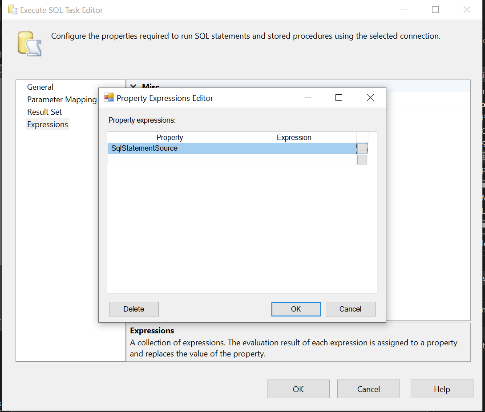

This section depicts error handling and logging in SSIS.

Create a table to store the error log using an SQL task transformation

Place a SQL task transformation on the Event Handlers table with the following config

The expression builder for the SQL task transformation on the event handlers tab

To enable SQL logging, right click on the dataflow canvas and configure SQL logging as depicted below

To enable file logging, right click on the dataflow canvas and configure file logging as depicted below

The control flow

The dataflow

