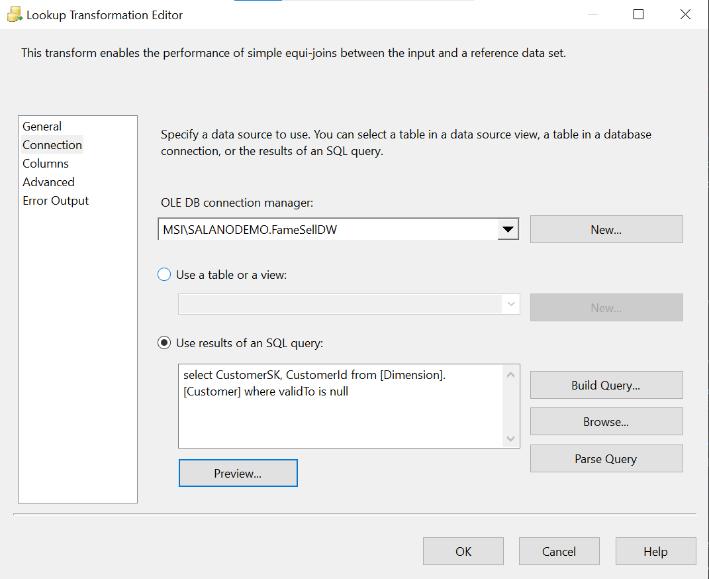

This section functions on loading a DWH fact table

Code for staging table

```
CREATE TABLE [Fact].[Orders_update](
	[CustomerSK] [int] NULL,
	[EmployeeSK] [int] NULL,
	[ProductSK] [int] NULL,
	[DateSK] int NULL,
	[OrderId] [int] NULL,
	[Quantity] [int] NULL,
	[UnitPrice] [decimal](18, 0) NULL,
	[TaxRate] [decimal](18, 0) NULL,
	[LastEditedWhen] [datetime2](7) NULL
) ON [PRIMARY]
GO
```

Control flow Steps/Transformations:

Staging Table creation

Migrate data to fact table (Data flow task)

Update Fact table from staging table


DataFlow Steps/Transformations:

Source connection

Customer lookup


Customer Derived column (missing surrogate key)

Employee Derived column (missing surrogate key)

Product lookup


Product Derived column (missing surrogate key)

Date lookup


Date Derived column (missing surrogate key)

Fact table lookup


Fact orders Ole Odb destination

Conditional Split

Staging Fact orders Ole Odb destination


Control Flow

Dataflow


Source data:
orders table

Dimension Tables:
Customers

Dates

Products

Fact Tables
Fact orders table

