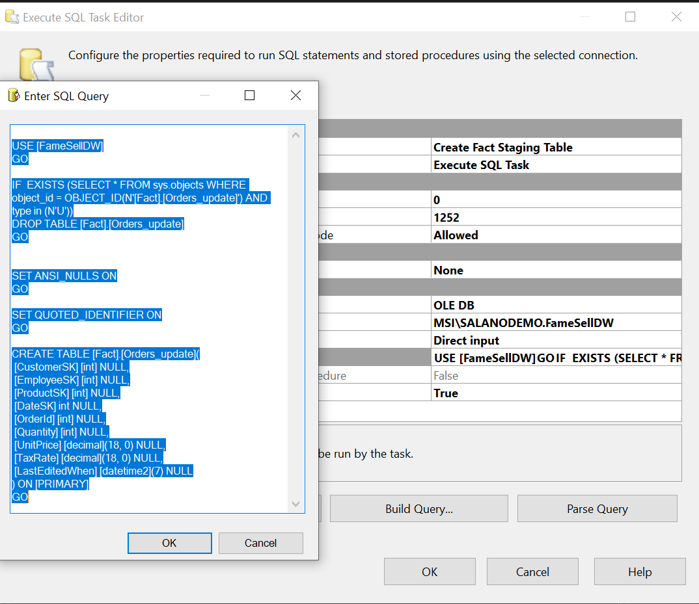
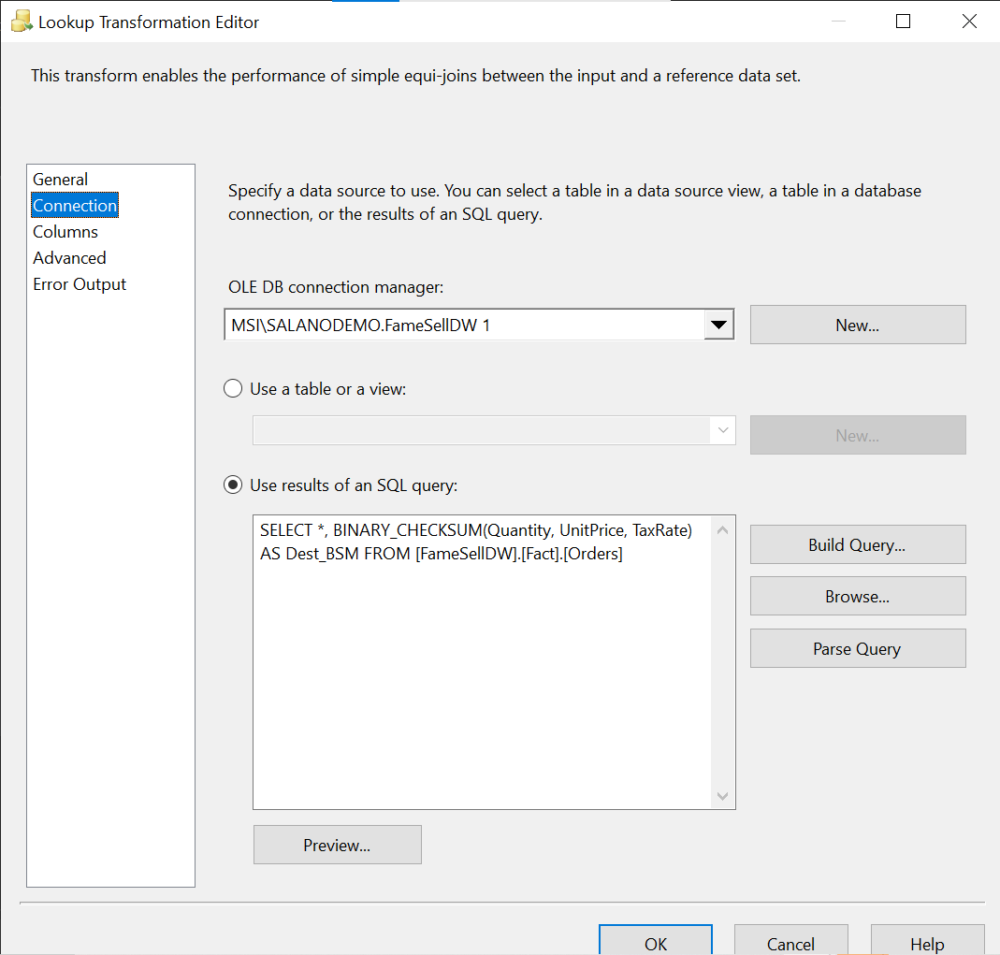
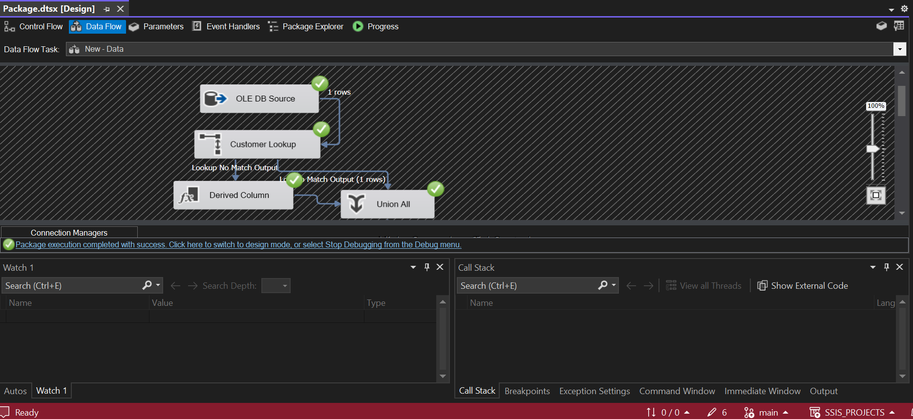

This section demonstrated the incremental load of a fact table. This is the traditional configuration on an ETL job in production.

This job has the following functionality:
Incremental load - Load data since last load
A table config - Which hold the table and the last hold date.
An audit table - When was the tablename and the records inserted/updated
An event error log table - Contains SSIS job failure details
SQL logging is stored in the [dbo].[sysssislog] table in the SQL database systems

Table definitions:

```
--audit log table
IF NOT EXISTS(SELECT 1 FROM sysobjects with (nolock) WHERE ID = OBJECT_ID(N'Demo.audit_log') AND type = (N'U'))
create table Demo.audit_log
(
	id int identity,
	packagename varchar(200),
	tablename varchar(200),
	recordsinserted int,
	recordsupdated int,
	dated time
)

--config table
IF NOT EXISTS(SELECT 1 FROM sysobjects with (nolock) WHERE ID = OBJECT_ID(N'Demo.config_table') AND type = (N'U'))
create table Demo.config_table
(
	id int identity,
	tablename varchar(200),
	lastupdatedColumn varchar(100),
	lastupdatedvalue datetime
)
--Error log table
IF NOT  EXISTS(SELECT 1 FROM sysobjects with (nolock) WHERE ID = OBJECT_ID(N'Demo.Error_Logs') AND type = (N'U'))

CREATE TABLE Demo.Error_Logs(ID INT IDENTITY, MachineName varchar(200), PackageName varchar(200), TaskName varchar(200), ErrorCode int,
ErrorDescription varchar(max), error_date datetime)

--Staging table for Data warehouse
IF  EXISTS (SELECT * FROM sys.objects WHERE object_id = OBJECT_ID(N'[Fact].[Orders_update]') AND type in (N'U'))
DROP TABLE [Fact].[Orders_update]
GO


SET ANSI_NULLS ON
GO

SET QUOTED_IDENTIFIER ON
GO

CREATE TABLE [Fact].[Orders_update](
 [CustomerSK] [int] NULL,
 [EmployeeSK] [int] NULL,
 [ProductSK] [int] NULL,
 [DateSK] int NULL,
 [OrderId] [int] NULL,
 [Quantity] [int] NULL,
 [UnitPrice] [decimal](18, 0) NULL,
 [TaxRate] [decimal](18, 0) NULL,
 [LastEditedWhen] [datetime2](7) NULL
) ON [PRIMARY]
GO
```

SQL transformation to create config tables

SQL transformation to create staging tables

SQL transformation getting last loaded date


SQL transformation to update data warehouse table from staging table


Variables used in SSIS job


New Data Transformation
Source Ole DB config - Load incremental data

Customer lookup - Get customer surrogate key (customerSK)

Customer derived - Set surrogate key to 0 if no surrogate key is found

Product lookup - Get product surrogate key (productSK)

Product derived - Set surrogate key to 0 if no surrogate key is found

Date lookup - Get date surrogate key (dateSK)

Date derived - Set surrogate key to 0 if no surrogate key is found

Fact lookup of source records against data warehouse fact table


Fact table insert (records not fount in data warehouse table) -- destination table

Fact table update (records not fount in data warehouse table) -- stage destination table


Event handler configuration


Source data:
orders table

Dimension Tables:
Customers

Dates

Products

Exectue the SSIS job the first time. We can see the data flow to the 'No match' path in the fact table look up.

Fact Tables
Fact orders table output after initial job run


We update order 1 unitprice in the source table and re-executed the SSIS job

```
update [FameSell].[dbo].[Orders]
set UnitPrice = 300
where OrderID=1
```



We can see the data flowed into the 'matched' path of the fact table lookup in the SSIS job.

After the SSIS job execution, we can see the destination warehouse fact order table being updated with the changes for order one.

