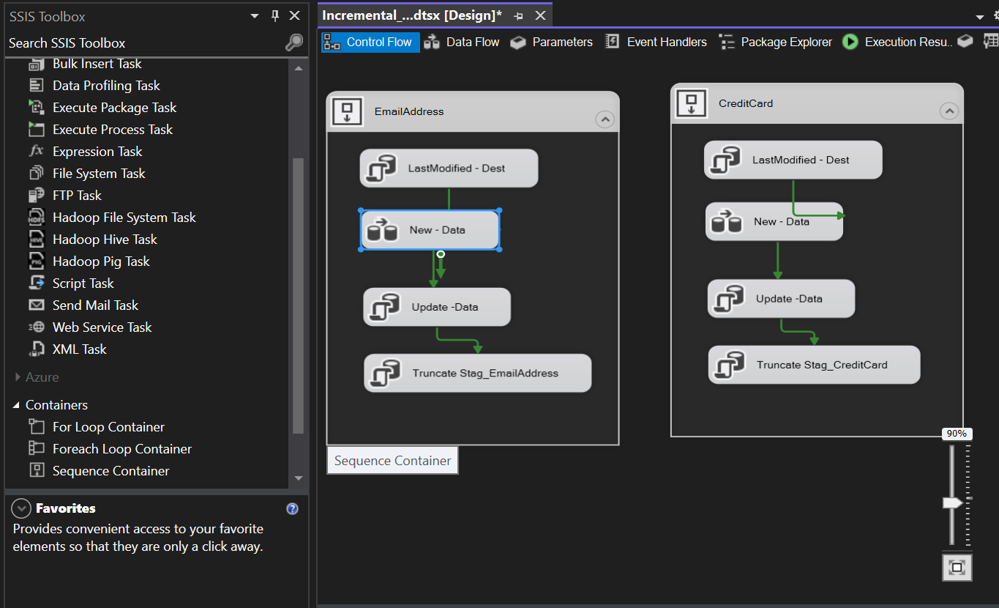
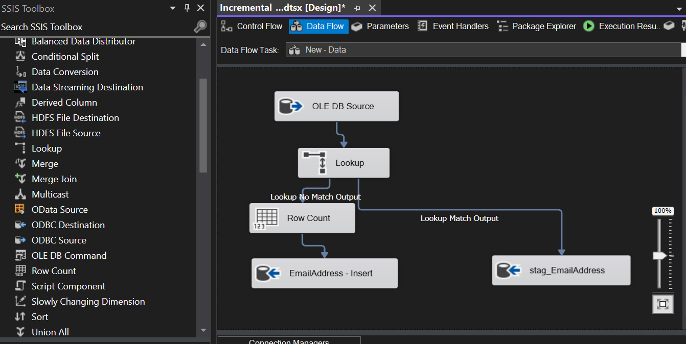
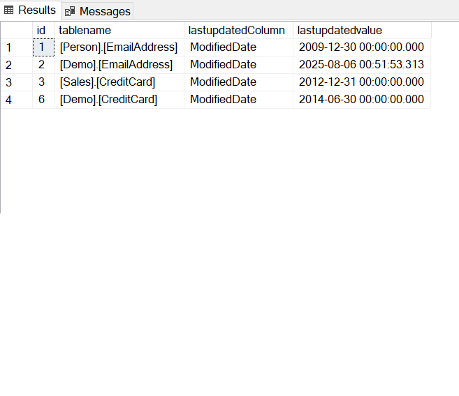

In this section, I demonstrate the core steps for incremental loading a destination table from a source table.<br />

The job inserts new records into the destination table and updates existing records.<br />

```
--audit log table
create table Demo.audit_log
(
	id int identity,
	packagename varchar(200),
	tablename varchar(200),
	recordsinserted int,
	recordsupdated int,
	dated time
);
```

Table to store log of SSIS job runs <br />
definition:<br />
id - identifier<br />
packagename - SSIS package used in job run<br />
tablename - Destination Table records are inserted/Updated into<br />
recordsinserted - Records inserted<br />
recordsupdated - Records Updated<br />
dated - time job ran<br />

```
--config table
create table Demo.config_table
(
	id int identity,
	tablename varchar(200),
	lastupdatedColumn varchar(100),
	lastupdatedvalue datetime
);
```

Table used to config SSIS job runs<br />
id - identifier<br />
tablename - destination table<br />
lastupdatedColumn - Name of column storing when record was lastupdated<br />
lastupdatedvalue - max date and time of record in last table update<br />

```
select *
into Demo.EmailAddress
from [Person].[EmailAddress]
where ModifiedDate <= '2009-12-30 00:00:00.000';
```

Query to insert some data into destination table <br />

```
--get a last updated date for email table
select max(ModifiedDate) from [Demo].[EmailAddress]
```

Query for last date and time of table update<br />

Steps to build SSIS Control/Data flow<br />

Add sequence container (EmailAddress) to control flow<br />
create two variables:<br />
LastUpdated_Email - Datetime<br />
RecordsInserted_Email int<br />
Add 'execute SQL task' (LastModified - Dest) to container and update 'LastUpdated_Email' variable with 'lastupdatedvalue'from config table using SQL code:<br />

```
select coalesce(max(lastupdatedvalue),CAST('1970-01-01 00:00:00' AS DATETIME))  from Demo.config_table where tablename = '[Demo].[EmailAddress]'
--add second to update time if there're milliseconds in date
```

Add 'DataFlow Task' (New - Data) to container (See DataFlow task section for details) <br />
Add another 'execute SQL task' (Update -Data) to container and add email table update and config <br />insert SQL as follows (addRecordsInserted_Email variable as parameter of query ):

```
Declare @updatedRecords int
--update main table
UPDATE a
   SET a.[BusinessEntityID] = b.[BusinessEntityID]
      ,a.[EmailAddress] = b.[EmailAddress]
      ,a.[rowguid] = b.[rowguid]
      ,a.[ModifiedDate] = b.[ModifiedDate]
from Demo.[EmailAddress] a inner join [dbo].[stag_EmailAddress] b
on a.[EmailAddressID] = b.[EmailAddressID]
set @updatedRecords = (select @@ROWCOUNT)
--insert audit log record
insert into Demo.audit_log
select 'Incremental_load.dtsx','Demo.[EmailAddress]',?, @updatedRecords, GETDATE()
--update last update value of table
update Demo.config_table
set lastupdatedvalue = (select MAX([ModifiedDate]) from Demo.[EmailAddress])
where tablename = '[Demo].[EmailAddress]'
	and (select count(1) from Demo.[EmailAddress]) > 0``

```

Add another 'execute SQL task' (Truncate Stag_EmailAddress) to container to truncate stage table using SQL code:<br />

```
truncate table [dbo].[stag_EmailAddress]
```

This is what the completed Control flow looks like


The data flow steps for the aforementioned 'DataFlow Task' is as follows:
Add 'OLE DB Source' (Truncate Stag_EmailAddress) add SQL command - add 'LastUpdated_Email' variable as parameter:<br />

```
select
*
from [Person].[EmailAddress]
where ModifiedDate > ?
```

Add 'lookup' task (LastUpdated_Email) with SQL on destination system (Redirect rows to no match output, also map columns on identifier):
``select 
	EmailAddressID
from demo.[EmailAddress]`

```

Add 'Row Count' task to 'lookup no match output' and add 'RecordsInserted_Email' variable (will insert row count in audit table)<br />
Add 'OLE DB Destination' (EmailAddress - Insert) and set table to 'Demo.EmailAddress' configure mappings<br />

Add 'OLE DB Destination' (stag_EmailAddress) to 'lookup match output' path and create new staging table for records to be updated<br />

Here is what the completed Dataflow looks like:


Here is the output of a populated config table:


Here is the output of a the audit_log table after peforming incremental loads at various times:

```
