This section dipicts key configs to load a XML and JSON files to SQL server tables.

Control and Data flows
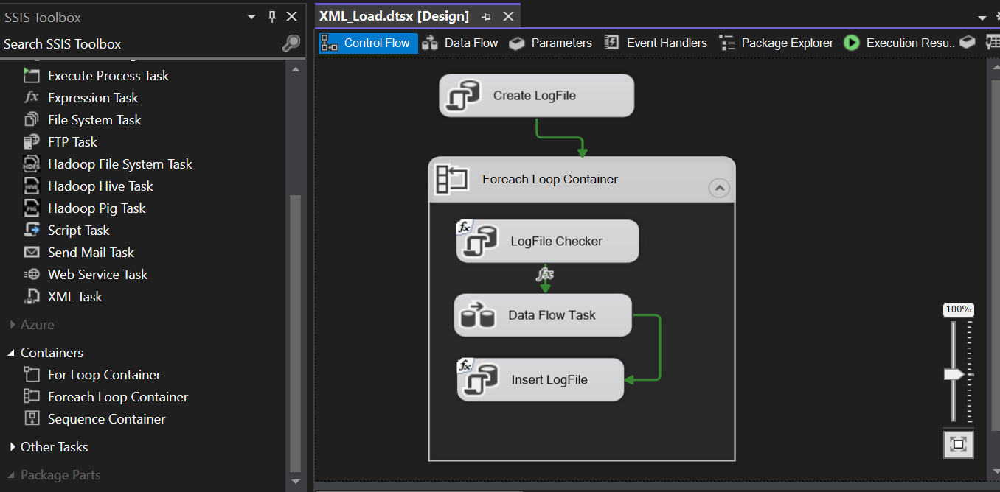

Variables
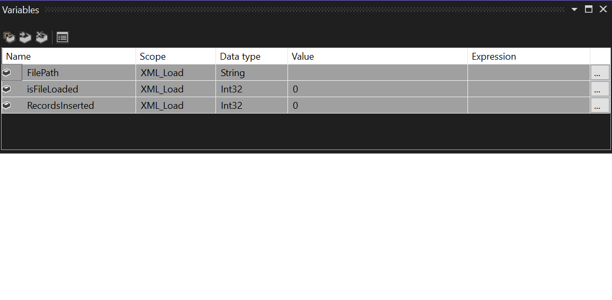

Create log file to track file load
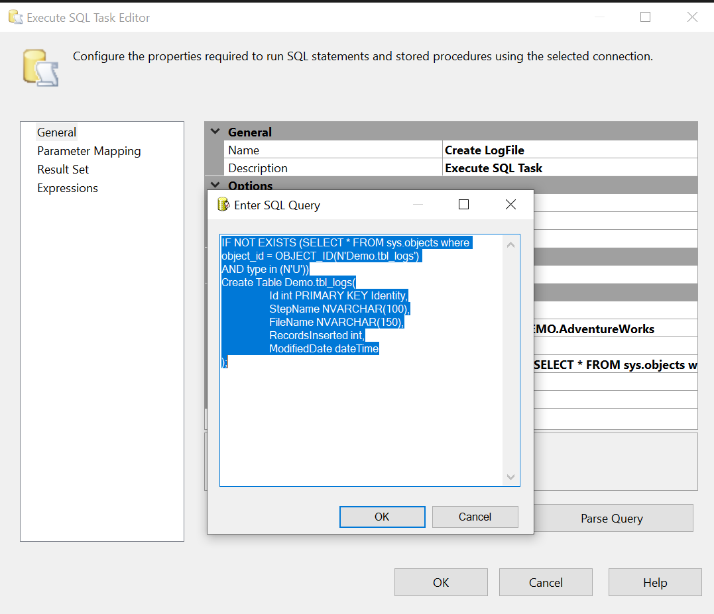
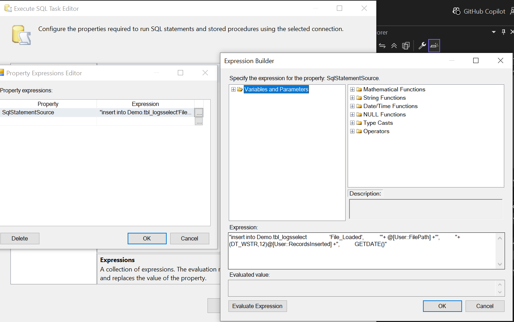

XML transformation config
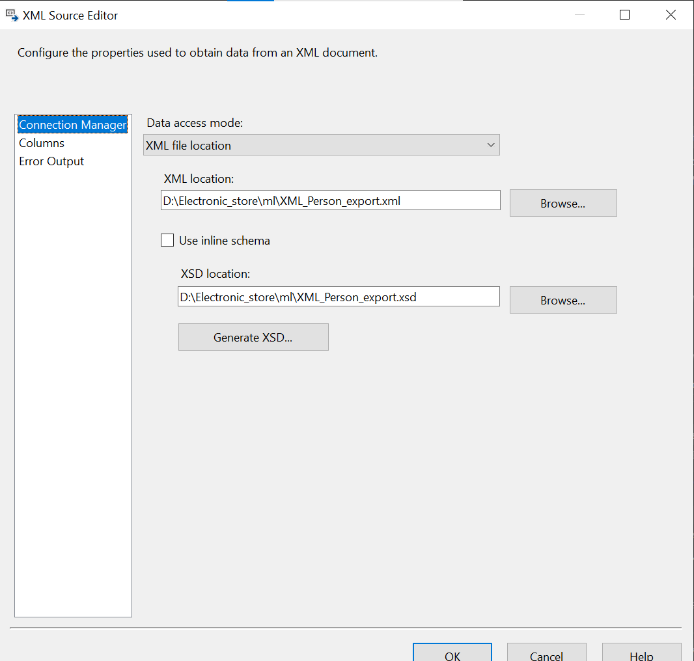

JSON Loading
Script Componenet config
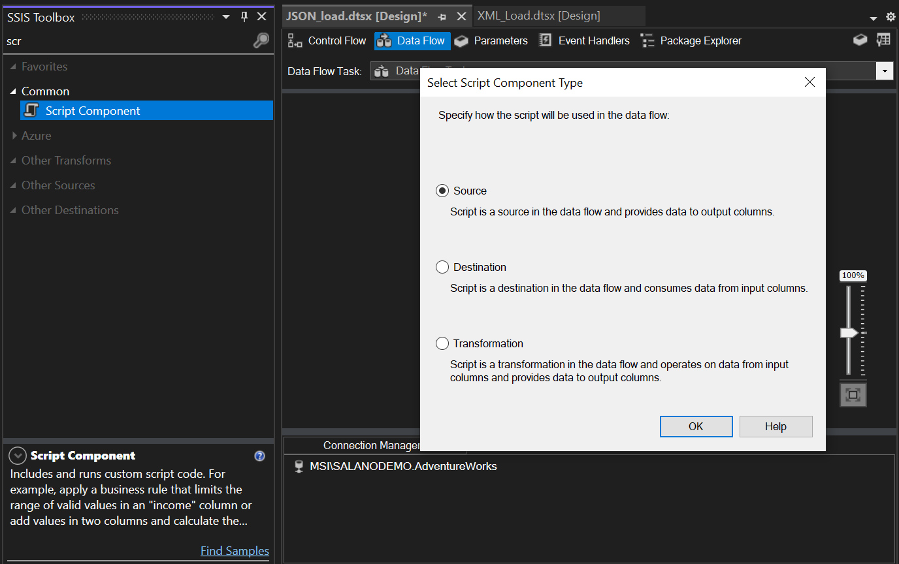
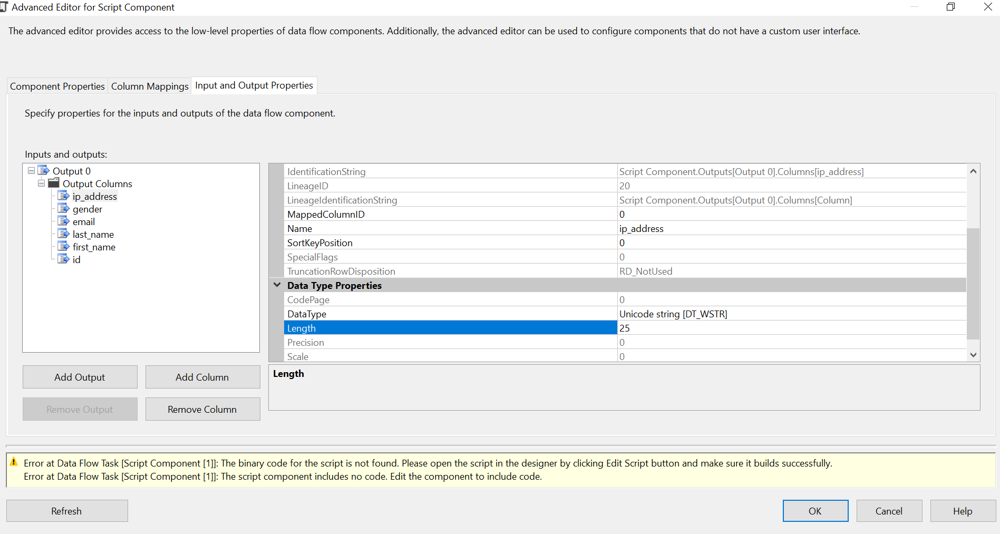

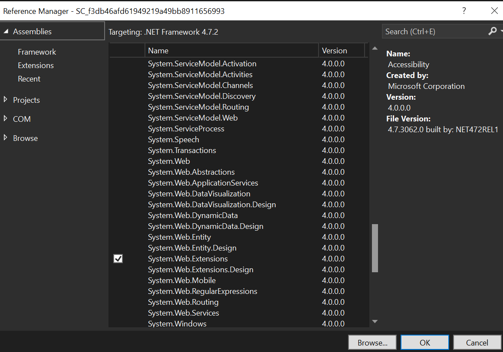
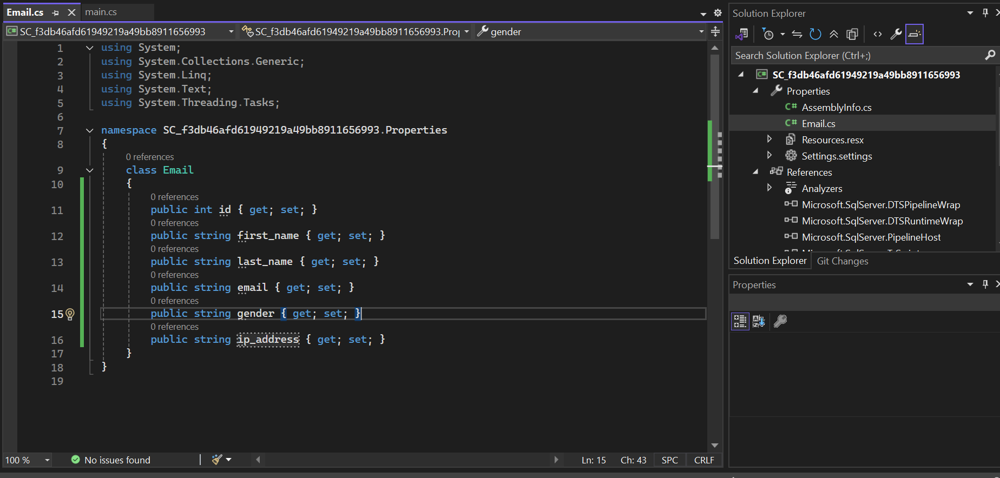
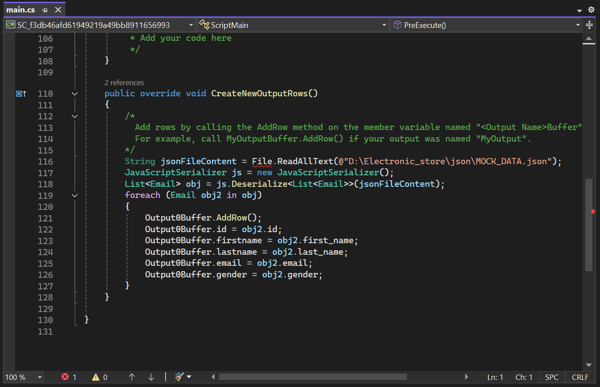

Control and data flow
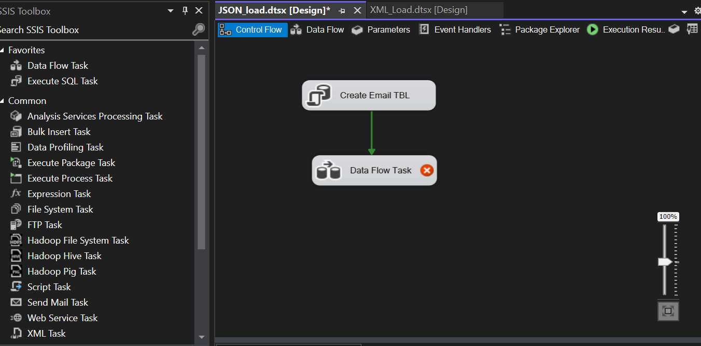
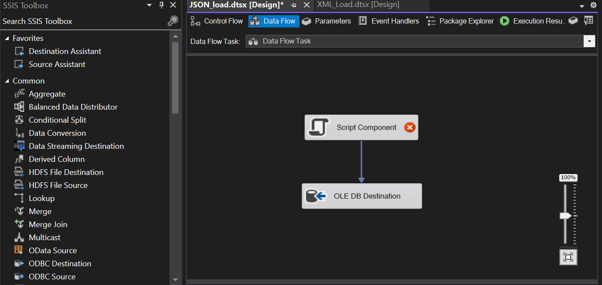
